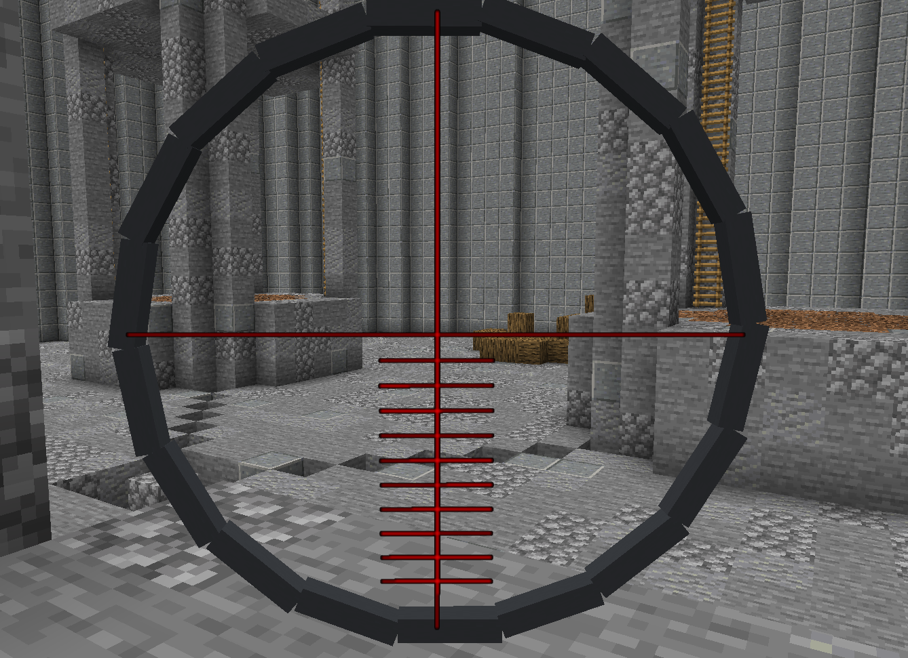
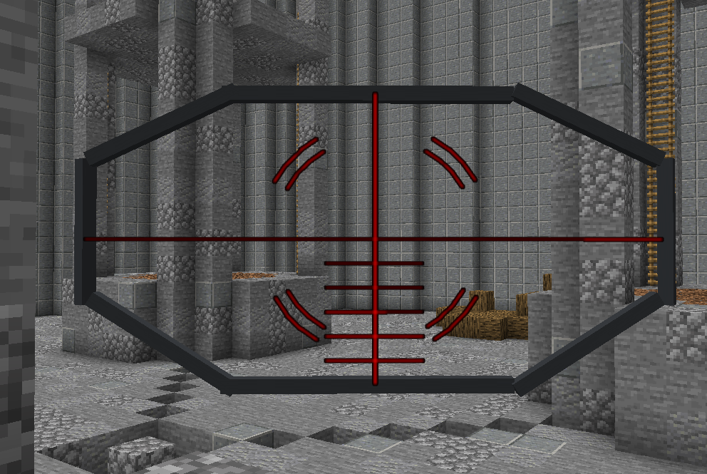
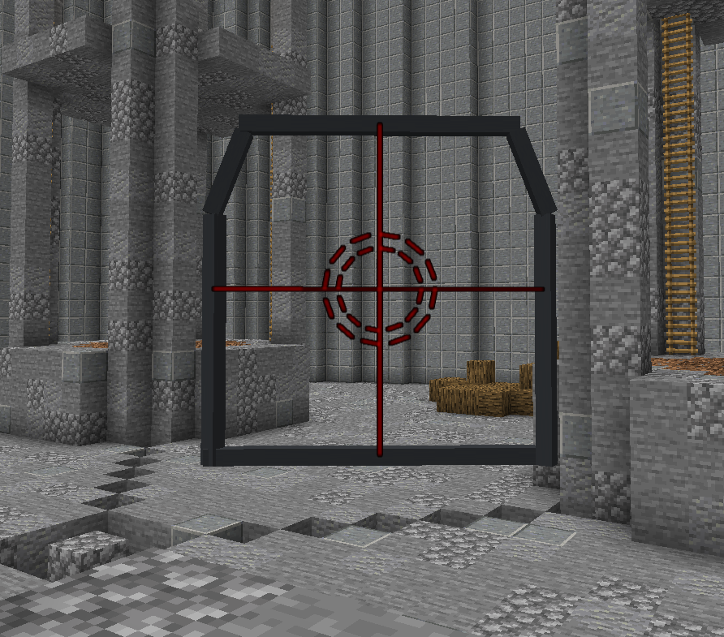

# Guns
A gun plugin for PaperMC Minecraft.

---

Make anything into a gun, highly customizable!
`/guns`

### Featuring Scopes:
NO RESOURCE PACKS REQUIRED!!
You can change the scopes of guns `/guns edit scopeType 'type'`
 
Sneak to activate the scopes!

- Type: Sniper Scope, for range
  
- Type: Spread Scope, for shotguns
  
- Type: Assault Scope, for rapid fire guns
  
